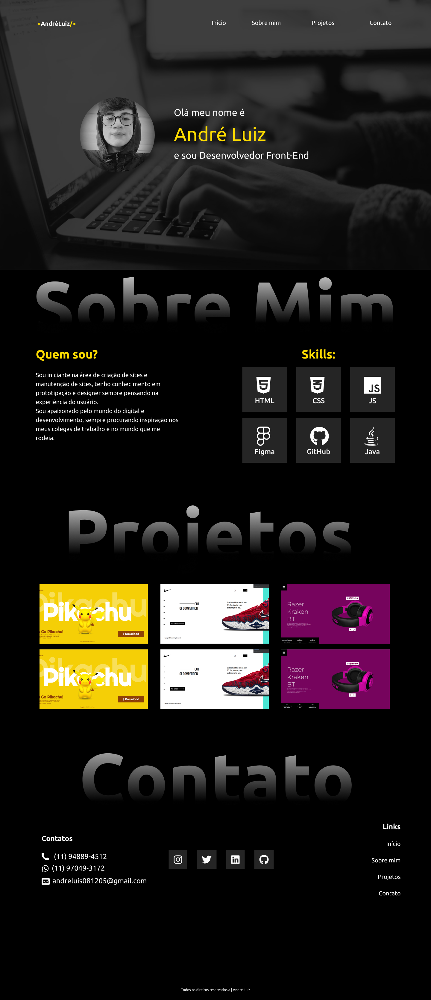

# Portifólio 

---
## Sobre:
Site feito com a intenção de divulgação do meu trabalho, apresentando um pouco sobre mim, projetos feitos e formas de contato comigo.
O objetivo deste projeto é a aprendizagem através dos conhecimentos adquiridos no curso do [SENAI Jandira](https://jandira.sp.senai.br/).
[Clique aqui para acessar o site](https://andreluisconstantino.github.io/portifolio-Senai/)

---
## Tecnologias utilizadas
- HTML5
- CSS3
- Responsividade
- Markdown

---
## Autor

Contatos:
- [Linkedin](https://www.linkedin.com/in/andr%C3%A9-luiz-constantino-4b779124a/)
-  WhatsApp - (11) 97049-3172
